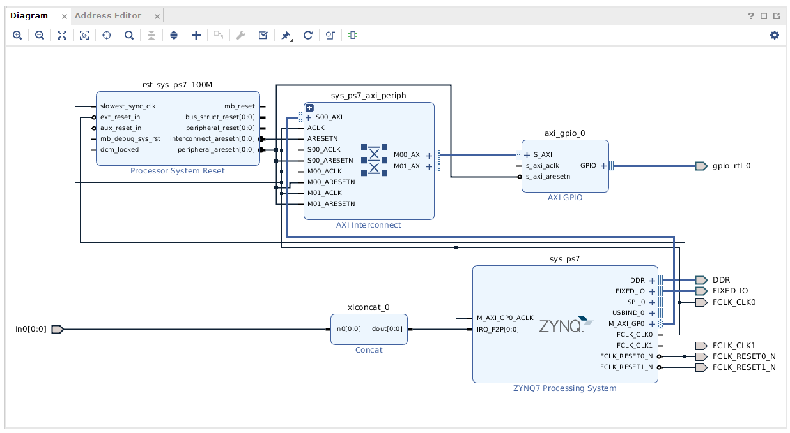

# HelloWorld Example

This design illustrates the tool flow for putting a custom design into the PlutoSDR hardware.
This design simply toggles the user LED based on the SCU Timer.

## Block Design

## Building

`$ make`   Builds hardware and software (see outputs in export/) \
`$ make load`  Connects to hardware and boots design 

Misc.

In hw/

`$ make proj`       : Creates a new project (does not build) \
`$ make synth`      : Synthesises only \
`$ make par`        : Place and route \
`$ make gui`        : Launches Vivado gui.

In sw/

`$ make gui`    : Launches Vivado SDK gui.

## Terminal output
`$ minicom -b115200 -D/dev/ttyUSB0`
